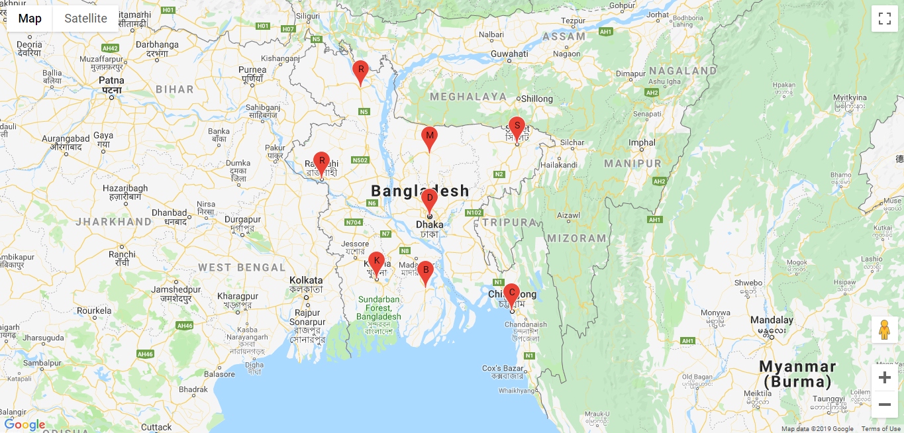

# Simple Google Maps Marker Clustering
Simple google maps marker clustering api, Features included:
- Maps with marker
- Set marker in several location

## Required Changes

```
Set latitude and longitude for desired location
```

```
Set your google api key in "APP KEY"
```

```
Set latitude and longitude in location array where you want to show marker
```

### Demo Images


```

```


